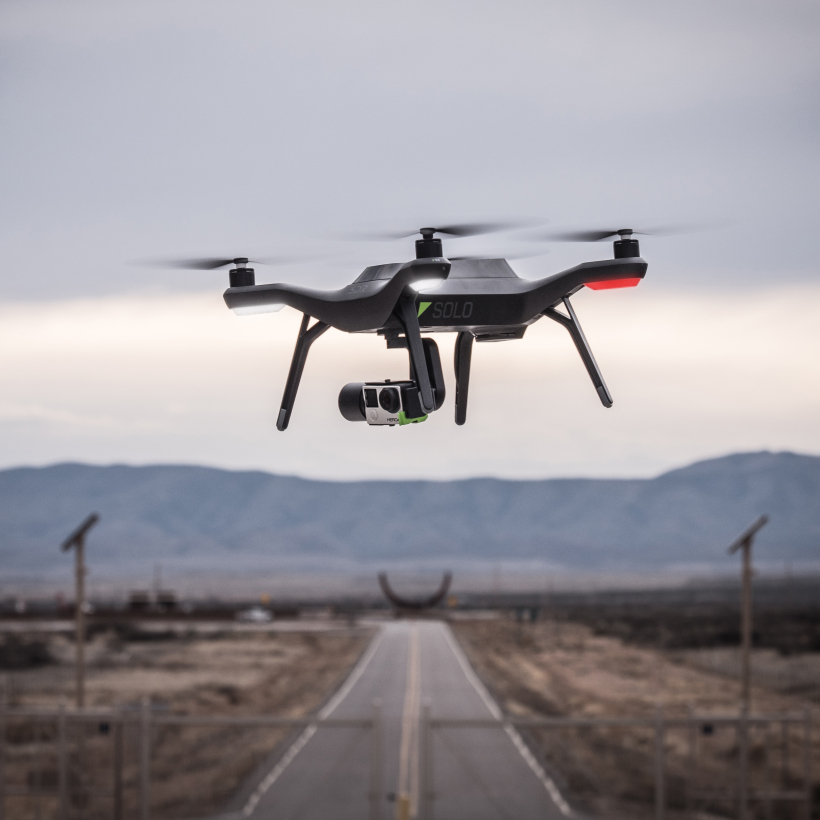

title: 3DRobotics
subtitle: Internship, Drones
thumbnail: ../img/projects/solo.jpg
categories: professional
---
<link rel="stylesheet" type="text/css"  href="css/grid.css">

# 3DRobotics

## TL;DR
Between June 2015 and January 2016 I spent time working at 3DRobotics on a 6 month internship. 3DRobotics sells consumer level drones for aerial cinematography.

While at 3DR I worked on Precision Landing. This was a continuation of my work with [Vision Guided UAV Landing](precland-proj.html). Except this time I was implementing it in a commercial product. Solo(the drone pictured above) includes a 1Ghz linux computer and a gimballed camera(Gopro).

Additionally, I kickstarted a company wide hackathon and help my hackathon team make a swarm of drones in 4 days.

**vv** *scroll down for videos/pics* **vv**

---

## The Goal
Enable the drone to land on autonomously on a target using computer vision. Currently the drone lands within 6 feet of where it took off using GPS. This can cause problems when coming in for tight landings i.e. boat landings, between two trees, on a mountain peak, on a charging mat, etc. Precision Landing would allow the user to land within 3 inches of the center of the mat.

### Attempt 1:
My first attempt involved a 13 degree FOV camera that was hard mounted to the bottom of Solo. This meant it tilted with the drone as the drone moved. This caused to camera to swing around every time the drone moved horizontally. This configuration is workable except the camera was a 2 fps, 320×320 pixel, 13 FOV image. This meant the landing mat wasn’t really in view unless you were right over the target(seems kind of useless). I was able to make it work but it wasn’t ideal. This version piggy backed off the camera module of completely different project-lets call it project belly cam. So when project belly cam got cancelled my project lost it’s camera.

### Attempt 2:
When I lost my camera I had to find a new one. Luckily, Solo was designed for Aerial Cinematography and had a camera that could be pointed downward. This caused some issues because I had already pegged the CPU running computer vision on a low res 2 fps camera. So I had to optimize an algorithm that I had already optimized once. Keep in mind that I started out with a quad core 1.5ghz processor when I did the UAV vision guided landing project with a 30 fps VGA camera. Now I am using a single core 1Ghz CPU that is already running at 40% load with a 720p 60 fps camera. Sigh.

### The Result:
I was able to identify the landing mat’s location, orientation, and distance at 12 fps between 1 and 11 meters altitude. I am able to achieve 3 inches of precision with a 75cmx75cm mat in low wind.

<iframe width="716" height="430" src="https://www.youtube.com/embed/-S9D6E8H2d4" frameborder="0" allowfullscreen></iframe>

<iframe width="716" height="430" src="https://www.youtube.com/embed/OIqjK-t4mAw" frameborder="0" allowfullscreen></iframe>

---

## Other work:
In addition to working on Precision Landing, I helped make Solo a better developer platform. Besides being an aerial filming rig, Solo can be used for development and hacking. It runs opensource software, has an API, and contains an accessory port. I helped test the docs and software and created examples for users.

### Hackathon:
While working at 3DR I helped start and organize a week long company hackathon. As word of the event spread, it gained traction among employees and a more senior coworker took the lead on organizing a larger scale hackathon. In the end I got the ball rolling and assisted in organizing the documentation.

During the hackathon I worked on “Solo swarm” with the goal of flying *n* number of Solos in formation in order to capture a cinematic shot from multiple angles. The team consisted of 3 people who took on 3 different roles:

#### Networking:
Modify Solo’s network architecture to allow multiple drones to be connected to one controller. This required a redesign of the network plumbing and wifi stack.

#### Command and Control(My role on the project):
Communicate with multiple drones on a single network, route vehicle status messages and control commands properly, and abstract vehicle specific protocol(mavlink). The system consisted of a SwarmHost which was the central connection point for the swarm and a n number of SwarmClients. The SwarmClient allowed different systems to subscribe and broadcast to drones in the swarm. Drones could be individually identified or a universal broadcast could be sent. SwarmClient was used by our 3D visualizer, path planner, and watchdog.

In addition to providing a clean and simple interface for controlling the drones, I worked on some smaller subsystems:

- Helped design the control scheme utilized by our path planner.
- Implemented a watchdog which monitored for potential collisions and “rogue” drones. It had the ability to lock out the path planner.
- Implemented special land and takeoff sequences for the swarm. (most thrilling part of the flight in my opinion)

#### Path Planning:
Involved generating trajectories for vehicles in the swarm. It would output desired position and velocity for each drone in the swarm at 15hz. The path planner allowed us to scale, translate, and rotate the swarm on all axis. We were unable to demonstrate all transforms due to minimal degrees of freedom with the stock joystick controller.

A polygonal pyramid was chosen as the formation shape for demoing purposes. The idea being that you have your subject under the centroid of the swarm with drone 1 being the top of the pyramid and all successive drones make an n sided polygon at the base of the pyramid. This would allow you to capture the subject from equally distributed positions. We were only able to fly a 6 drone pyramid but we were able to simulate up to 20 drones before our simulation bogged down the CPU.

We tested some other formations in simulation such as the “Solo system.” Which was a solar system made out of solos. It was designed for cool long exposure shots. It was never tested in real life due to time constraints.

#### Demo:
Below you will find videos of our week long hackathon project:

<iframe width="716" height="430" src="https://www.youtube.com/embed/upvVZhcsSsA" frameborder="0" allowfullscreen></iframe>

**Note:** The swarm moves very slowly for safety of the audience and drones. Most position discrepancies are caused by barometer drift.

---

### Gallery

  

    

      

        </img>
        </img>
        </img>
        </img>
        </img>
        </img>
        </img>
        </img>
        </img>
        </img>
        </img>
	    

    

  

